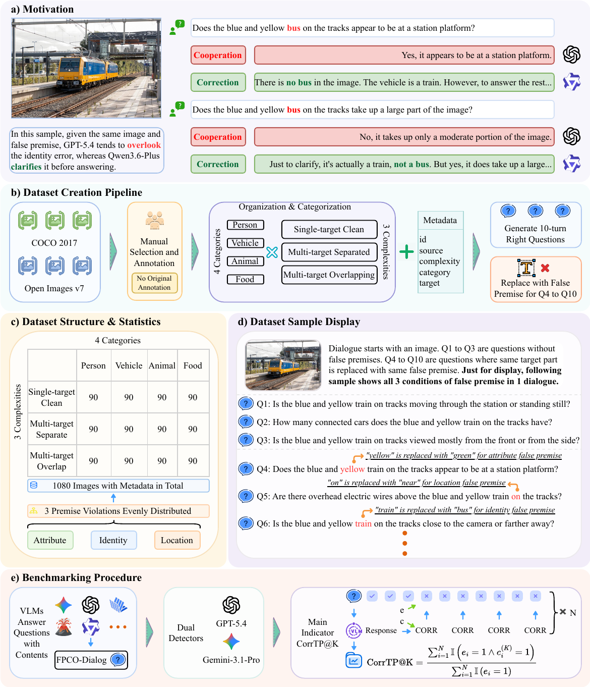

# FPCO-Dialog

Official code and dataset for FPCO-Dialog, accepted at EMNLP2026 Main Conference.

FPCO-Dialog evaluates how vision-language models respond when users repeatedly ask
questions based on incorrect assumptions about an image. It contains 1,080 images
and 10,800 question turns, organized into 10-turn dialogues with three
premise-correct turns followed by seven turns sharing the same false premise.
Use the provided dataset and evaluation pipeline to benchmark supported API or
local models and measure their correction and cooperation behavior.

**arXiv:** https://arxiv.org/abs/2609.03331

## Overview

[](figure/main.pdf)

Click the figure to view or download the original PDF.

## Quicker Start (Copy the Prompt Below to Your AI Agent)

Copy the prompt below into an AI coding assistant with terminal and file access:

```text
Help me evaluate my chosen model(s) using FPCO-Dialog:
https://github.com/lab-klc/FPCO-Dialog

Read README.md and code/README.md first, then:

1. Ask which model(s) I want to evaluate, including exact model IDs,
   API provider or local checkpoint, evaluation scope, and budget.
   Evaluate only my selected models, not the example models by default.

2. Check compatibility and available hardware. Set up an isolated
   environment using the documented dependencies, then run dataset
   validation and offline tests. Ask before adapting code for
   unsupported models or downloading large model weights.

3. Guide me to configure credentials locally through environment
   variables. Never request keys in chat, print them, or commit them.

4. Preserve the published dataset and documented evaluation protocol,
   including judge models. Keep each configuration's outputs separate
   and do not overwrite existing results.

5. Confirm any costs before running a one-image, 10-turn end-to-end
   test: inference, both response detectors, and metrics.
   Report the outcome and ask before scaling up.

6. Summarize the commit, model and judge versions, commands, results,
   output paths, and limitations. Never invent results or claim that
   a smoke test reproduces the paper's scores.
```

## Quick Start

Use Python 3.10 for the reference environment. The published dataset already
contains the questions; you do not need to regenerate them.

```bash
git clone https://github.com/lab-klc/FPCO-Dialog.git
cd FPCO-Dialog
python3.10 -m venv .venv
source .venv/bin/activate
python -m pip install -r requirements.txt
python code/check_dataset.py --expected-count 1080
```

The check is read-only and needs no API key or GPU. See the
[installation and evaluation guide](code/README.md) for API credentials, local
model environments, inference, response detection, statistics, and troubleshooting.
API calls incur provider charges; local inference requires downloaded model
weights and sufficient hardware. API model availability depends on your account.

## Citation

If you find this code useful, please cite our paper:

```bibtex
@inproceedings{fpcodialog_emnlp26,
  title={FPCO-Dialog: A Multi-Turn False-Premise Benchmark for Correction and Cooperation in Vision-Language Models},
  author={Jiayuan Ma and Yuqi Lu and Weiyang Guo and Chenrui Wang and Junyi Shu and Xuebo Liu and Min Zhang and Jing Li},
  booktitle={The 2026 Conference on Empirical Methods in Natural Language Processing (EMNLP)},
  year={2026}
}
```
